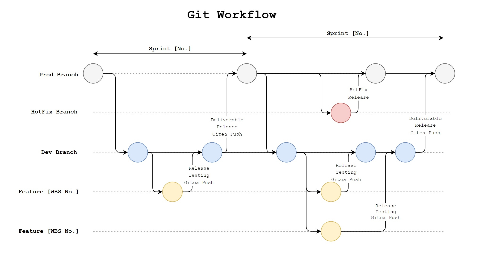

# PAI WMR LMCM Additions

## Preface - Lean Mean Coding Machines Semester 1 - Peter Hunt

Like the last team this readme is being written at the end of the project. The number of unexpected life events was a lot and finishing the original requirements was all that could be done. This project was built on the previous teams Model-View-Controller framework which was very useful. Working with PAI and Alison in particular has been amazing, hoping future students get to enjoy the time working with her as well.

Like Scott before me, this readme might not be the best documentation but variable names and comments in the code should mean the project is readable.

I'll do the same as Scott before me and add my email (peter.hunt666@gmail.com) in case the project really is completely obtuse and you need some help. Understand neither I nor Scott can actually help you with anything your doing, only explain what we've already done.

## Introduction
See Scott's previous readme at the end of this one to get the understanding of the original project work that LMCM's new additions are built on. For the new work done, Persimmons Australia Inc. (PAI) has asked UniSQ students to add the ability to host the weekly reports in the database, and have the administrators control which growers can access these reports, as well as add a review page to reduce grower consignment errors.
This is all built on Web Tech 1 and 2 as taught by UniSQ and the database is best understood with the Database Systems course. Knowing Agile, OOP and other software development tools will be useful in continuing this project.

## Authors
Peter Hunt
Back-End Development

Alex Love
Back-End Development

Sean Florance
Front-End Development

Mitchell Hollands
Front-End Development

## Previous Work Authors
Scott Law
Back-End Development

Mark Symonds
Front-End Development

## Main Features

- Admin can view list of reports
- Admin can search reports by title
- Admin can upload reports
- Admin can select users with viewing access when uploading
- Admin can change users with viewing access in report list
- Admin can view reports from report list screen
- Growers can see only reports they can access
- Growers can search for reports in report list
- Growers can view reports
- Growers are shown a review when all required fields have data and a message otherwise
- Grower consignments are only submitted when all required fields are filled correctly and have been reviewed

## Project Structure

This web application is built on Scott and Marks previous application which uses the model-view-controller paradigm. The proejct has continued to use the same naming and folder structure conventions as the previous.

### Controllers

The admin and grower controllers have been modified to allow for the features mentioned above; see Scott's readme below for more information.

### Views

New views have been added with the same naming sheme as the previous project's.

### Models

There are new models for reports and report access in order to keep the OOP design philosophy into account. These new models use the same naming conventions as the previous preojct.

## Technology

### Azure Cloud

Check Scotts readme for information on the Azure cloud, its complicated and you should set up your own development environment and begin tinkering right away.

### Front-end

- HTML
- CSS
- JavaScript
- jQuery

### Back-end

- PHP
- MySQL (language and database)

## Development

### Git Workflow

We transitioned to github later in the project after using XAMPP to run development as it was faster than waiting for the Azure deployment each time. See Scott's readme for the git workflow.

### Development Environment

We used the same XAMPP apache server but also the MySQL database it comes with too. Our editor was VSCode like Scott and Mark.

## Comments
We have hopefully used good variable names and added comments where needed. For the final presentation we are using githubs comparison tool to show the difference between our work and the previous team's work. If you keep track of your changes you may not need to do this.

# Past README STARTS HERE

# Weekly Market Report Web Application

## Preface - SM Digital Solutions Semester 2 2022 - Scott Law

Stupidly this readme was written right at the end of the project. I know, I know, you're rolling you're eyes at us and saying how unorganised we were blah, blah, etc etc. The project was much larger and more robust than either of us thought it was going to be. At the same time it was more enjoyable than either of us had anticipated. We ended up as a two person team down from four. So assignments, documentation, and project work suddenly double when you have half a team... who would have thought? So with that in mind, we ask for your forgiveness and hope that at least this attempt at providing some form of documentation is better than nothing. This project was built on from an existing project before us in semester 1 of 2022, though it is barely recognisable besides some of the front-end assets and colour schemes. It also used an MS online form as a reference point which (I think, don't quote me on it) was built in semester 2 of 2021.

In all honestly, it's been an absolute privilege completing this work for PAI. More specifically, it been great working with Alison who has been a fantastic client to collaborate with. We hope that any future students who work with her and PAI get the same experience.

If worst comes to worst and this readme is terrible (ugh, it probably will be) then feel free to email me. I can't promise I'll be able to help out fully, I'll be moving on with my life and making the big bucks in the software dev world, but I can probably answer a few questions if parts of the web application don't make sense at first glance.

scott.rj.law@gmail.com

If you follow on from us good luck! We hope this application is easy to understand and you'll add some fantastic additions.
## Introduction

This is the web application for Persimmons Australia Inc (PAI). The aim of this application is to provide persimmons growers with the ability to submit their persimmons consignment data. This data contributes to a weekly market report which is an analytics service performed by PAI. There are also administration features which allow PAI administrators to add new growers and modify existing grower data. This readme will aim to provide an overview of some of the features given in the web application, as well as some insight on the back-end and structure of the project for any future student developers who might take on this project after us.

We built this application with skills and technologies we understood learnt, from our time at USQ. We also believed that this would give the best chances that future students taking over from this project would also have the same skills. We mostly used things we learnt in Web Technology 1, Web Technology 2, and Database Systems. But of course, any software development techniques and tools e.g. OOP, Agile, etc. are going to be very beneficial.

## Authors

Scott Law
Back-End Development

Mark Symonds
Front-End Development

## Main Features

- Password sign-in authentication
- Consignment submission to database
- Grower can view their account details
- Grower can change their password
- Admin can search for grower in database
- Admin can edit grower account information (but not their userID)
- Admin can reset/change the password of users
- Admin can add new grower into database

## Project Structure

This web application uses the model-view-controller paradigm. There are heaps of resources on this online so it shouldn't be too difficult to get a grasp of it if you haven't learnt it already. The folder structure shows the controllers, views, and models are comparmentalised.

### Controllers

The controllers are the reference point for (almost) all website pathing. Whenever a path is set, it is always set as if the controller files are the root. You'll notice this in the front-end pages in the view folders. The file paths are all referenced from the point of view of the respective controller. A single controller will represent one part of the web application. The admin management for admin pages, the grower_consignment for all grower related pages, and the grower login page for the login functionality.

Note: In hindsight the controllers should have really been created as classes and then a controller handler class created to handle the actions. However, I've built it in a similar fashion to how Web Tech 2 had us build stuff in that course. Even though it's a bit clunky it should be easily understood if you've done that course.

### Views

The views represent what the user will see. The view folder contains all the pages and are sectioned based on their functionality.

### Models

The models access the database. There is one main model database.php which is the connection to the remote database. In version control this is the dev database that we used. By the time you receive this that database might be shutdown already, so the credentials in version control may not work. So it's up to you to create a new dev database. You should be able to get the schema from the production database on the Azure cloud service. You can probably export it as a SQL file, and then run it locally, or on another remote database so you can use these models to engage with the data.

Notes: Another in hind sight moment! I shouldn't have made the models as static class. I have no idea why I thought it was a good idea at the time. Maybe I thought it was cool. I really think the models should be regular classes and that a database connection be passed to the respective model object instead. When in doubt OOP, and static classes should rarely be used in OOP.

We also recommend not putting production credentials into version control. We added them manually to the Azure cloud web application after we deployed the web application onto the PAI Azure.

## Technology

### Azure Cloud

We deployed this application on the PAI Azure cloud. Hopefully they will have all the information for you regarding that.
At this point the service should have a Windows VM that serves the PHP web application, and a MySQL database that stores the back-end data.

### Front-end

- HTML
- CSS
- JavaScript
- jQuery

### Back-end

- PHP
- MySQL (language and database)

## Development

### Git Workflow

How you run your git workflow is up to you, but it might be helpful to know how we did it. This image should provide some insight

### Development Environment

We used XAMPP to test and serve our application locally. This was so we could make changes safely in a local environment. We only used the apache server, but you're more than welcome to use the MySQL server that comes with it.  We used a remote MySQL database on our student Azure cloud. This was so we could emulate connecting to a remote database. It was slightly more involved. Two extra things were needed. The certificate authority certificate. You'll see that in the CA folder in the models folder. And for direct access to the database using something like MySQL Workbench, we opened the firewall on the Azure cloud to allow all traffic (0.0.0.0). Otherwise you will need to manually add your local IP via the networking menu everytime you want to do something. This does not effect the operation of the webapp. The credentials are the way we stopped malicious users. In the wake of the OPTUS data breach we were pretty vigilant with how the database could be accessed. To mitigate the open firewall, we strongly recommend using dummy grower user details in the test database.

VSCode was the IDE of choice for us, but that is certainly up to you to decide.

## Comments

The rest of the information is comments in the code!

